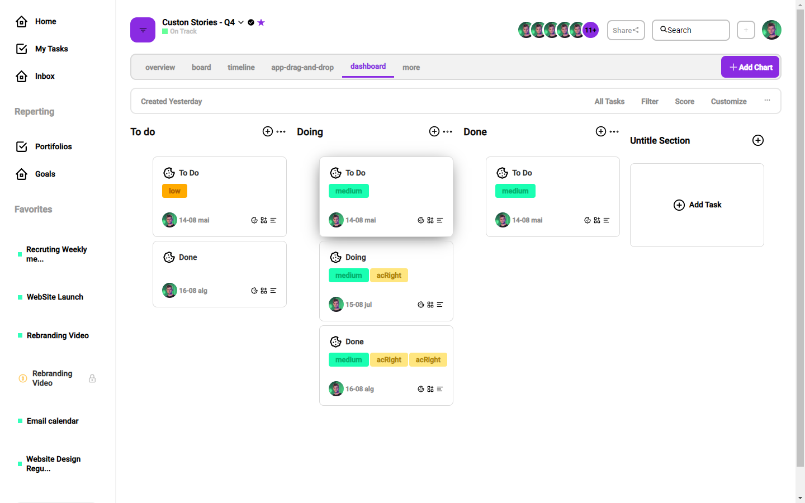

# Todo list app 

  

 

## Technologies used

- framer motion
- nextjs

### Future technologies
- prisma
- axios
- graphcms

## Installation

- yarn install or npm install
- yarn dev or npm run dev

## Contribute

describe your commits, and try to use good practices.

## Note

the project is not yet documented, but I will document it soon
